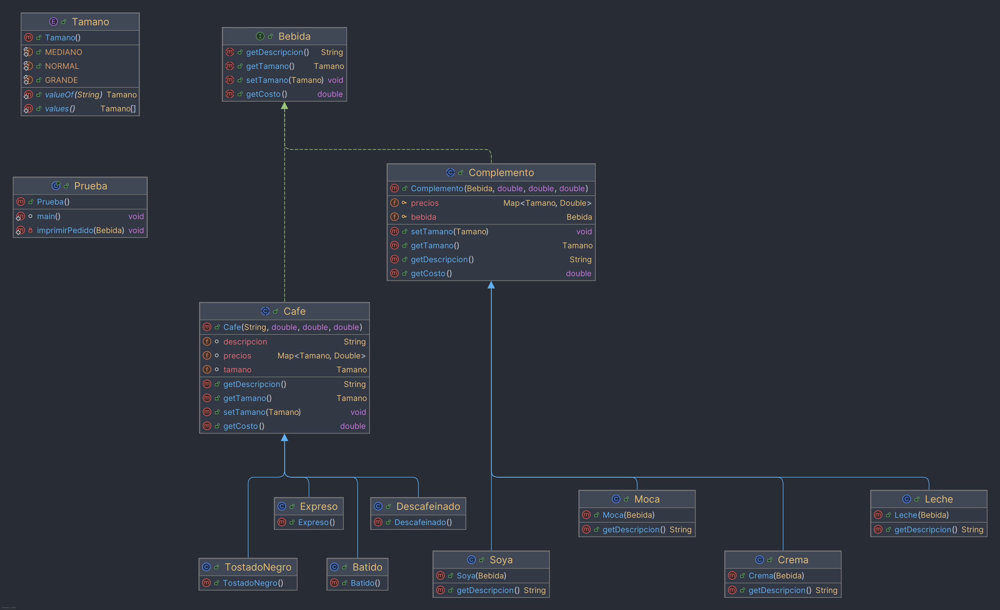

# Cafetería el Negrito — Patrón Decorator con Tamaños
## Descripción del problema

La empresa **Cafetería el Negrito** ofrece distintas variedades de café
(Tostado Negro, Batido, Descafeinado, Expreso) que el cliente puede
personalizar agregando complementos (Leche, Moca, Soya, Crema). Cada
complemento se suma al pedido y su precio se añade al costo total de la
bebida.

En la Parte 1 del laboratorio se implementó este comportamiento usando el
**patrón Decorator**: el café es el componente base y cada complemento es
un decorador que "envuelve" a la bebida anterior, añadiendo su propio
precio sin modificar las clases ya existentes.

En la Parte 2 se amplió el sistema para que la cafetería pueda manejar
**tres tamaños de bebida**: Normal (N), Mediano (M) y Grande (G), cada uno
con un precio distinto tanto para los cafés como para los complementos.
Esta parte se resolvió usando un `HashMap`, según lo recomendado en clase.

## Patrón de diseño aplicado: Decorator

El patrón Decorator permite añadir funcionalidades a un objeto de forma
dinámica, envolviéndolo en una o más clases "decoradoras" que comparten
una interfaz común con el objeto original. En este proyecto:

- **`Bebida`** es el componente: la interfaz que comparten tanto los
  cafés como los complementos.
- **`Cafe`** es el componente concreto base: define el costo y la
  descripción inicial de la bebida.
- **`Complemento`** es el decorador base: envuelve una `Bebida` y le
  agrega un precio extra según el complemento elegido.
- **`Leche`, `Moca`, `Soya`, `Crema`** son los decoradores concretos.

Esto permite armar pedidos combinando cualquier café con cualquier
cantidad de complementos, en cualquier orden, sin tener que crear una
clase nueva por cada combinación posible (por ejemplo, no existe una
clase `ExpresoConLecheYMoca`; en vez de eso, se van envolviendo objetos
en tiempo de ejecución).

```java
Bebida pedido = new Expreso();
pedido = new Leche(pedido);
pedido = new Soya(pedido);
pedido = new Crema(pedido);
pedido = new Moca(pedido);
```

## ¿Por qué se usó HashMap para los tamaños?

Antes de la Parte 2, cada café y cada complemento tenía un único precio
fijo guardado como un `double`. Al agregar tres tamaños con precios
distintos por producto, la opción más simple hubiera sido usar varios
`if`/`else` o un `switch` para decidir qué precio devolver según el
tamaño:

```java
// Lo que se quiso evitar
if (tamano == Tamano.NORMAL) return precioN;
else if (tamano == Tamano.MEDIANO) return precioM;
else return precioG;
```

Esto funciona, pero obliga a repetir la misma estructura condicional en
cada clase de café y de complemento, y crece mal si en el futuro se
agregan más tamaños.

En su lugar se usó un `Map<Tamano, Double>` (implementado con
`HashMap`), donde la clave es el tamaño y el valor es el precio
correspondiente:

```java
Map<Tamano, Double> precios = new HashMap<>();
precios.put(Tamano.NORMAL, 0.99);
precios.put(Tamano.MEDIANO, 1.09);
precios.put(Tamano.GRANDE, 1.19);
```

Con esto, obtener el precio de cualquier bebida según su tamaño se
reduce a una sola línea, sin condicionales:

```java
public double getCosto() {
    return precios.get(tamano);
}
```

Esta misma lógica se aplicó tanto en `Cafe` como en `Complemento`. El
tamaño de la bebida se define una sola vez en el café base (con
`setTamano(...)`), y los complementos no guardan su propio tamaño: lo
consultan directamente del café que están decorando
(`bebida.getTamano()`). Así, al cambiar el tamaño del café, el precio de
todos los complementos que lo envuelven se ajusta automáticamente sin
tener que tocar nada más.

## Diagrama de clases



## Estructura del proyecto

El proyecto está organizado por paquetes según la responsabilidad de
cada clase dentro del patrón Decorator:

- **`labs11.modelo`**: el contrato del patrón (`Bebida`) y el enum de
  tamaños (`Tamano`).
- **`labs11.bebidas`**: el componente base abstracto (`Cafe`) y los
  cafés concretos (`TostadoNegro`, `Batido`, `Descafeinado`, `Expreso`).
- **`labs11.complementos`**: el decorador base abstracto (`Complemento`)
  y los complementos concretos (`Leche`, `Moca`, `Soya`, `Crema`).
- **`labs11.app`**: el punto de entrada (`Prueba`) donde se arman los
  pedidos combinando cafés y complementos.


## Tablas de precios usadas

### Café

| Café            | Precio N | Precio M | Precio G |
|-----------------|----------|----------|----------|
| Tostado Negro   | 0.99     | 1.09     | 1.19     |
| Batido          | 0.89     | 0.99     | 1.09     |
| Descafeinado    | 1.05     | 1.15     | 1.25     |
| Expreso         | 1.99     | 2.09     | 2.15     |

### Complementos

| Complemento | Precio N | Precio M | Precio G |
|-------------|----------|----------|----------|
| Leche       | 0.10     | 0.15     | 0.20     |
| Moca        | 0.20     | 0.25     | 0.30     |
| Soya        | 0.15     | 0.20     | 0.25     |
| Crema       | 0.10     | 0.15     | 0.20     |

## Pruebas realizadas

La clase `Prueba` arma cuatro pedidos distintos combinando los cuatro
cafés con distintos complementos, para comprobar que el patrón Decorator
funciona sin importar el orden o la cantidad de complementos agregados.
Se probó en dos partes:

- **Parte 1**: los pedidos se arman sin cambiar el tamaño explícitamente,
  por lo que todos toman el tamaño por defecto (`NORMAL`).
- **Parte 2**: a cada pedido se le asigna un tamaño distinto con
  `setTamano(...)` (Grande, Mediano o Normal) para verificar que el
  `HashMap` devuelve el precio correcto según el tamaño elegido, y que
  ese tamaño se propaga correctamente a todos los complementos.

## Salida del programa


